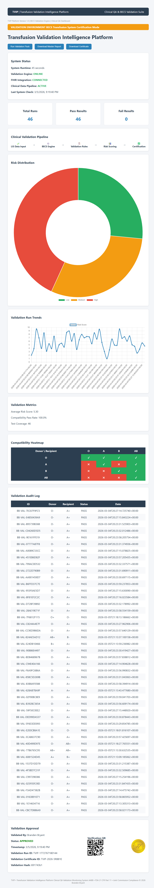
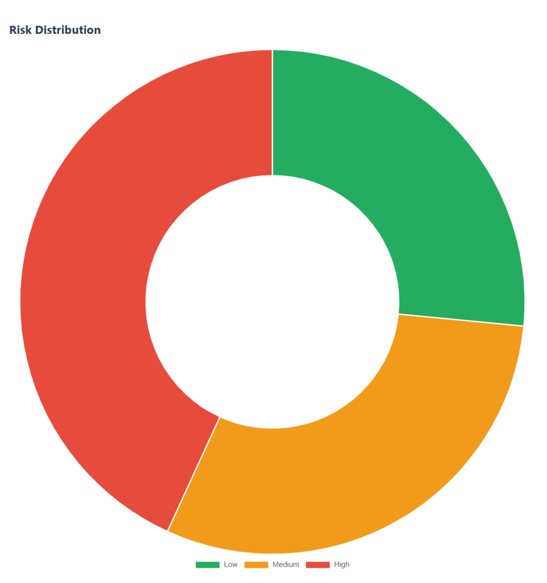

# Clinical Data Quality Monitor

A healthcare data validation platform designed to monitor clinical data integrity across laboratory and EHR systems.

The system analyzes HL7 clinical messages and laboratory results to identify missing segments, abnormal values, and potential data integrity issues during healthcare data exchange.

## Dashboard Preview

### Clinical Validation Dashboard

### Compatibility Heatmap

### Risk Analysis

## System Architecture

HL7 Message
     │
     ▼
HL7 Parser
     │
     ▼
Data Validation Engine
     │
     ▼
Lab Result Validator
     │
     ▼
Data Quality Score
     │
     ▼
FastAPI API
     │
     ▼
Clinical Dashboard

## Features

• HL7 message validation  
• Clinical laboratory result validation  
• Data quality scoring engine  
• REST API built with FastAPI  
• Healthcare data integrity monitoring

## Example Output

{
"hl7_validation": {
"status": "VALID",
"errors": []
},
"lab_validation": {
"status": "ALERT",
"alerts": [
"Critical WBC level",
"Critical Hemoglobin"
]
},
"data_quality_score": 70
}

## Technology Stack

Python 
FastAPI 
HL7 Messaging 
Healthcare Data Validation 
REST API

## Use Cases

Healthcare data integrity monitoring 
HL7 interface validation 
Clinical laboratory data validation 
EHR migration data verification

## Author

Branden Bryant 
Clinical Informatics & Healthcare Data Engineering
